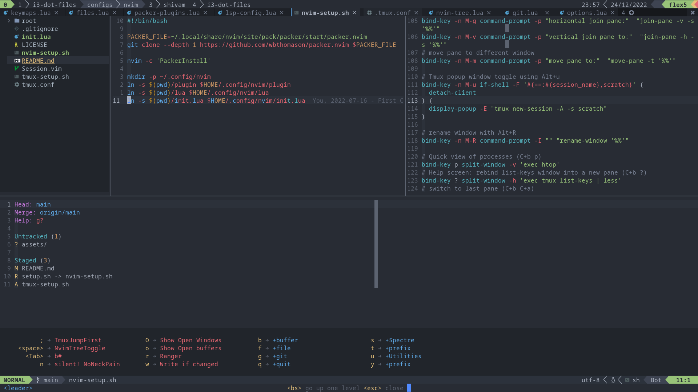
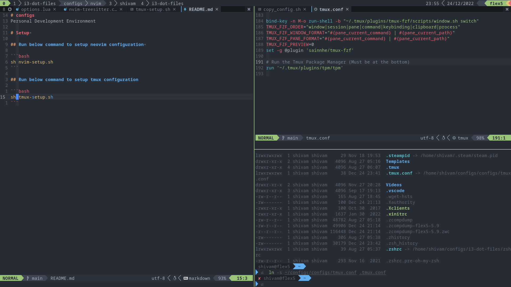
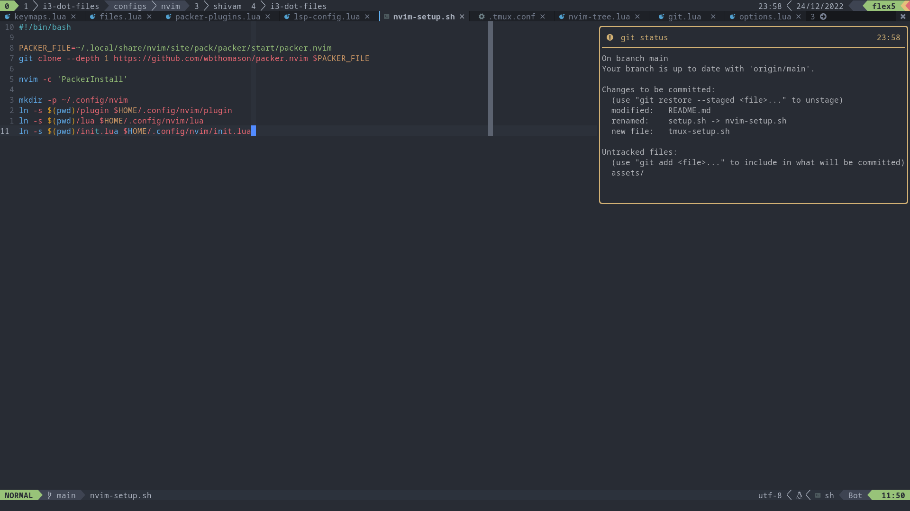
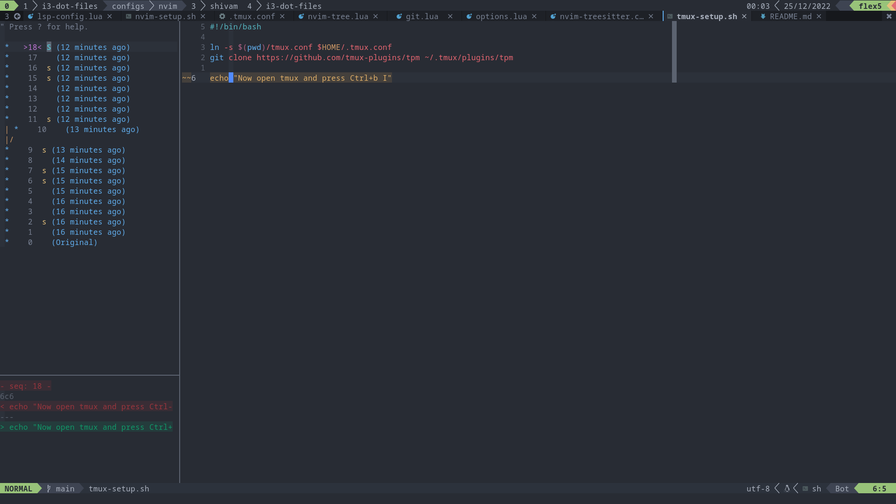

# configs
Personal Development Environment









# Setup 

## Run below command to setup neovim configuration 

```bash
sh nvim-setup.sh
```

## Run below command to setup tmux configuration

```bash
sh tmux-setup.sh
```
